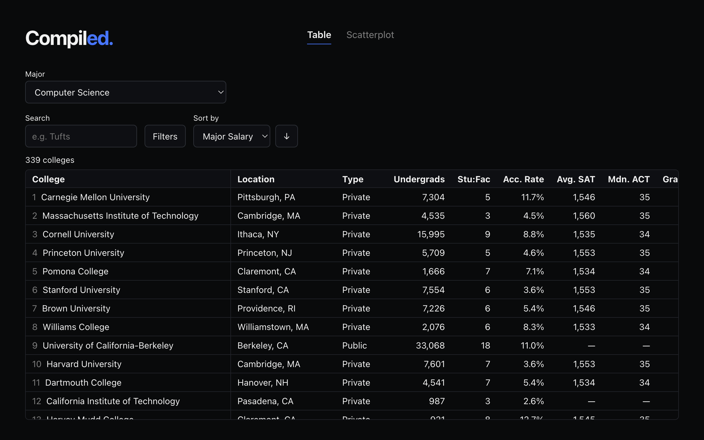
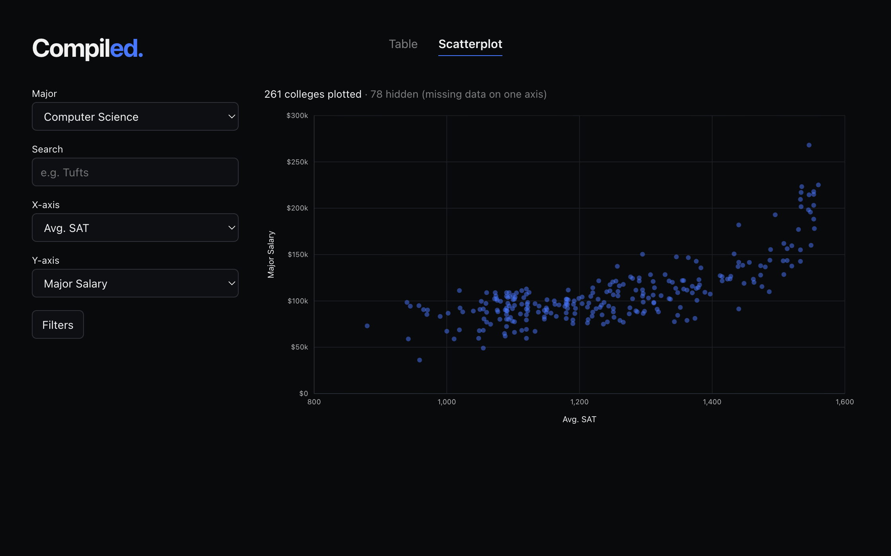

# Compiled

**Explore and compare U.S. colleges using major-specific outcomes and institution-level data.**

[Live Site](https://jackstuehler.com/compiled)

Compiled is an interactive college comparison tool built with data from the U.S. Department of Education's College Scorecard. It brings institution-level information and field-of-study outcomes all into one place, allowing users to compare colleges based on the major they are interested in.

Choose a bachelor's major to compare colleges across measures including undergraduate enrollment, student-to-faculty ratio, acceptance rate, SAT and ACT scores, graduation rate, average annual cost, and median earnings and debt both overall and for the selected major. Colleges can be explored in a sortable and filterable comparison table or plotted against one another using an interactive scatterplot with configurable axes.

## Features

### College Comparison Table

- Select a bachelor's major to compare colleges with reported outcomes for that field of study
- Search colleges by name or common abbreviation (e.g., "MIT" or "Penn State") and filter results by state and institution type
- Sort colleges by any available measure in ascending or descending order
- Compare institution-level metrics alongside major-specific median earnings and debt
- Share or revisit a selected major through the `?major=` URL parameter

### Interactive Scatterplot

- Plot any two numeric measures against each other using configurable X and Y axes
- Search for colleges to highlight them while preserving the surrounding data for context
- Filter by state and institution type
- Hover over individual points to view college details
- Click and drag to zoom into a region of the chart and reset to return to the full dataset
- See how many colleges are excluded from a plot because of missing data

## Tech Stack

| Layer         | Technologies                            |
| ------------- | --------------------------------------- |
| Frontend      | Next.js, React, TypeScript, CSS Modules |
| Data          | MySQL, `mysql2`                         |
| Visualization | SVG                                     |
| Deployment    | AWS EC2, nginx, pm2                     |

## How It Works

Compiled uses Next.js Server Components to query MySQL directly on the server. When a user selects a major, the selected CIP code is stored in the URL as a `?major=` parameter. The server uses that code to query the corresponding institution and field-of-study data before passing the results to the interactive client components.

The comparison table handles searching, filtering, and sorting client-side, allowing those interactions to update instantly without additional database queries. The scatterplot uses the same underlying college data and lets users dynamically select which measures to plot on each axis.

The scatterplot is built with SVG. Its visualization logic includes custom coordinate scales, dynamically generated axis ticks, hover interactions, search highlighting, and click-and-drag zoom.

## Data

Compiled uses data from the U.S. Department of Education's College Scorecard. The application draws from two of the Scorecard's "Most Recent" datasets:

| Dataset        | Raw Rows | Raw Columns |
| -------------- | -------: | ----------: |
| Field of Study |  227,980 |         178 |
| Institution    |    6,274 |       3,308 |

The raw datasets are filtered and transformed to retain the institutions, bachelor's programs, and measures relevant to Compiled. The resulting data is stored in three MySQL tables:

| Table           |   Rows | Purpose                        |
| --------------- | -----: | ------------------------------ |
| `institutions`  |  1,944 | Institution-level data         |
| `fos_bachelors` | 69,948 | Bachelor's field-of-study data |
| `majors`        |    429 | CIP code-to-major mappings     |

`institutions` contains information such as location, enrollment, acceptance rate, test scores, graduation rate, cost, and overall earnings and debt. `fos_bachelors` contains major-specific median earnings and debt, while `majors` maps CIP codes to major names avoiding repetition of the full major name across program records.

After accounting for missing or suppressed earnings data and requiring at least five colleges with reported outcomes, **235 bachelor's majors** are available for comparison in Compiled.

The application joins institution-level and field-of-study data by college and uses CIP codes to retrieve results for the major selected by the user.

## Technical Highlights

### Custom SVG Scatterplot

The scatterplot is implemented with with SVG rather than a charting library. It implements coordinate scaling, dynamically generated axis ticks, hover tooltips, search highlighting, and click-and-drag zoom. Zoom selections are converted from screen coordinates back into data values, allowing the chart to recompute its axes for the selected region.

### Performance

Compiled maintains a lightweight frontend without a UI or charting library. Across three Lighthouse tests, the deployed comparison table and scatterplot achieved median Performance scores of **95/100 and 98/100 on mobile**, respectively, and **100/100 on desktop**, with zero cumulative layout shift.

### Data Validation

While building the scatterplot, a large group of programs unexpectedly appeared at `$0` in major-specific earnings. Investigation showed that 42,491 privacy-suppressed values from the source data had been loaded as `0` rather than `NULL`, causing an existing `IS NOT NULL` filter to include them.

After correcting the affected values, the earnings data was validated against statistics calculated from the raw source data. Because the application already handled missing values, the existing queries and UI then behaved correctly without application-level changes.

### Configurable Measures

Shared measure definitions provide the label, formatting, and value-access logic used throughout the application. The same definitions power table sorting, scatterplot axis selection, and value formatting, making new measures easier to add without duplicating logic across components.

## Data Source

U.S. Department of Education, College Scorecard — Most Recent Institution and Field of Study datasets.

[College Scorecard Data](https://collegescorecard.ed.gov/data)
